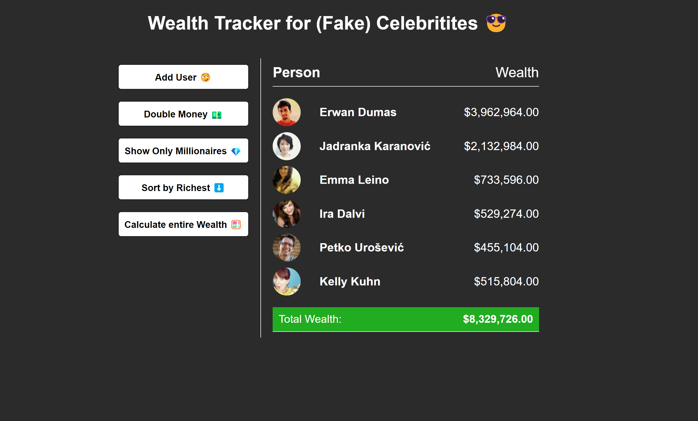

# Fake Celebrity Wealth Tracker - Array Methods Practice



## Welcome! 👋

Thanks for checking out my mini-project!

This project utilizes the Random User Generator API and high order array methods to manipulate fake celebrities' randomly generated net worth.

**To complete this challenge, I used HTML, CSS, and JavaScript. The person name and image data utilitzed is courtesy of the Random User Generator API.**

## Table of contents

- [Overview](#overview)
  - [The goal](#the-goal)
  - [Links](#links)
- [My process](#my-process)
  - [Built with](#built-with)
  - [What I learned](#what-i-learned)
- [Author](#author)

## Overview

## The goal

The goal for this mini-project was to build a simple UI to showcase data with an image, name, and wealth amount.

Your users should be able to:

- See three randomly generated celebrities immedietly on page load
- Add random celebrities
- Double the celebrities wealth
- Show only millionaire celebrities
- Calculate the total wealth of all celebrities appearing on the screen

## Links

Live Site URL: [https://juliawalton.github.io/celebrity-wealth-tracker/](https://juliawalton.github.io/celebrity-wealth-tracker/)

### Built with

- Semantic HTML5 markup
- CSS3
- Flexbox
- CSS Grid
- JavaScript
- Regular expression
- Fetch API
- Random User Generator API

## What I learned

This project was useful for practice working with various high order array methods. I haven't worked with sort very much in the past so I was happy to get experience with it.

```js
function sortByRichest() {
  people = people.sort((personA, personB) => {
    return personB.money - personA.money;
  });
  updateDOM();
}
```

## Author

- Website - [Julia's Portfolio](https://juliawalton.github.io/portfolio/)
- LinkedIn - [Julia Walton](https://www.linkedin.com/in/juliawalton/)
